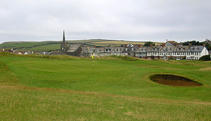
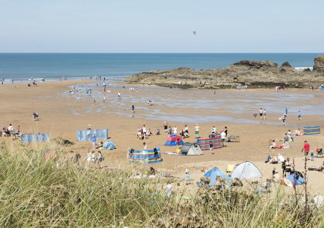
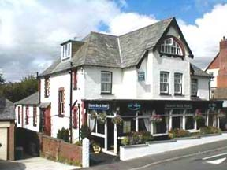

  
```{r message=FALSE, warning=FALSE, echo = FALSE}
suppressMessages(library("tidyverse"))
library(ggmap)
```

```{r message=FALSE, warning=FALSE, echo = FALSE}
a1 <- -4.544649
b1 <- 50.832559
a2 <- -4.551349
b2 <- 50.830540
a3 <- -4.553962
b3 <- 50.835869
a4 <- -4.543023
b4 <- 50.830066
```


```{r message=FALSE, warning=FALSE, echo = FALSE}
roadmap <- get_googlemap(center = c(a1, b1), zoom = 14, mapmaptype = "roadmap")
watercolormap <- get_map(location = c(a1, b1),source="stamen", zoom = 14, maptype = "watercolor")
```


#Map including marked locations
#Road map 
```{r message=FALSE, warning=FALSE, echo = FALSE}
ggmap(roadmap) +
  geom_point(aes(x =  a1 , y = b1),col = "red", size = 2) +
  geom_point(aes(x = a2 , y = b2),col = "green", size = 2) +
  geom_point(aes(x = a3 , y = b3),col = "blue", size = 2) +
  geom_point(aes(x = a4, y = b4),col = "yellow", size = 2)
```

#Watercolor map 
```{r message=FALSE, warning=FALSE, echo = FALSE}
ggmap(watercolormap) +
  geom_point(aes(x =  a1 , y = b1),col = "red", size = 2) +
  geom_point(aes(x = a2 , y = b2),col = "green", size = 2) +
  geom_point(aes(x = a3 , y = b3),col = "blue", size = 2) +
  geom_point(aes(x = a4, y = b4),col = "purple", size = 2)
```

#Road map from Golf Club to the beach to the Beach
```{r message=FALSE, warning=FALSE, echo = FALSE}
from <- "Bude and North Cornwall Golf Club"
to <- "The Barrel at Bude"
route_df <- route(from, to, structure = "route")
ggmap(roadmap) + 
  geom_point(aes(x =  a1 , y = b1), col = "red", size = 2) +
  geom_point(aes(x = a4, y = b4),col = "purple", size = 2) +
  geom_path(aes(x = lon, y = lat), col = "blue", size = 1, data = route_df, end = "round")
```
#Watercolor map from Golf Club to the beach to the Beach 
```{r message=FALSE, warning=FALSE, echo = FALSE}
from <- "Bude and North Cornwall Golf Club"
to <- "The Barrel at Bude"
route_df <- route(from, to, structure = "route")
ggmap(watercolormap) + 
  geom_point(aes(x =  a1 , y = b1), col = "red", size = 2) +
  geom_point(aes(x = a4, y = b4),col = "purple", size = 2) +
  geom_path(aes(x = lon, y = lat), col = "blue", size = 1, data = route_df, end = "round")
```


#Images









